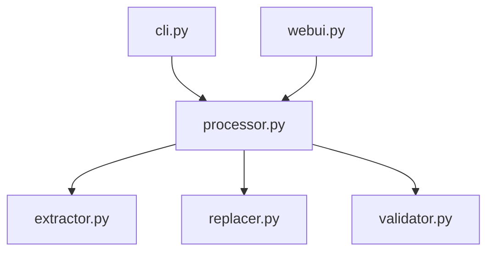

# Developer Guide

## Architecture

The application follows a modular design with these key components:

- `extractor.py`: Worksheet data extraction
- `replacer.py`: Placeholder replacement logic
- `processor.py`: Document-wide processing
- `validator.py`: Input validation
- `cli.py`: Command-line interface
- `webui.py`: Gradio web interface
- `ai_editor.py`: Optional AI editorial review helpers

## Module Dependencies

## Configuration
See `config.py` for customizable settings:
- Field mappings
- Logging configuration
- File size limits
- Need tokens
